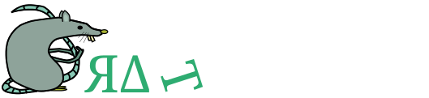

# Rat Common Library
<em>Common files, pah, rat thinks is like common cheese ...</em>

## Introduction
Contains common files for the Rat project.

## Installation
As this library is part of a collection of inter-dependent libraries a detailed description of the installation process is provided in a separate repository located here: [rat-docs](https://gitlab.com/Project-Rat/rat-documentation). A quick build and installation is achieved using the following steps:

Please clone the repository recursively to include the submodules:
```bash
git clone https://gitlab.com/Project-Rat/rat-common.git --recursive
```

Or update them after cloning using:
```bash
git submodule update --init --remote --recursive
```

Then make a build directory and use make to build the library:
```bash
mkdir build
cd build
cmake ..
make -jX
```
where X is the number of cores you wish to use for the build. 

When the library is build run unit tests and install using
```bash
make test
sudo make install
```

## Authors
* Jeroen van Nugteren
* Nikkie Deelen

## License
This project is licensed under the [MIT](LICENSE).