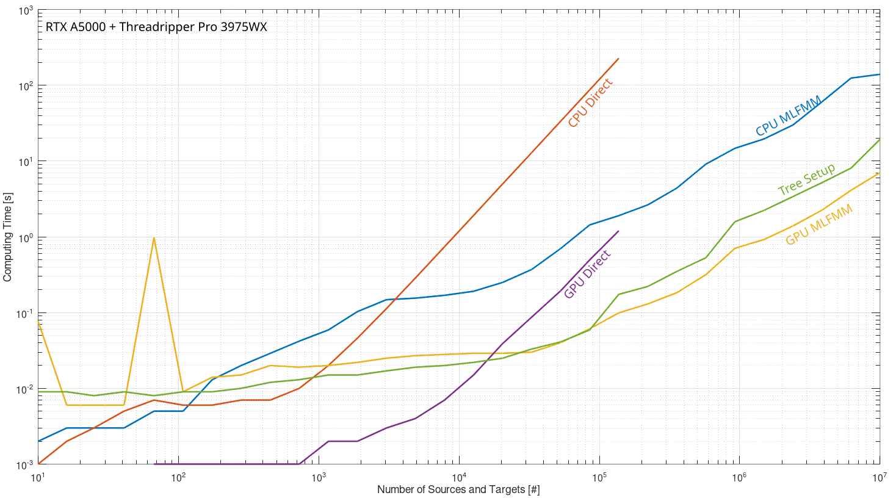

# Multi-Level Fast Multipole Method Library
<em>Hellooo Rat thinks Multipole-Method very fast. Leaves time for other things yes?</em>

## Introduction
The Finite Element Method (FEM) proves to be very inefficient in the calculation of coil magnetic fields due to fine mesh required around the cables making up the coil pack. Therefore, often straight forward Biot-Savart integration is used to calculate coil fields at specified target points and iron mesh. However, this type of algorithm scales with O(NxM), where N is number of sources and M is number of target points, which for some coil geometries can result in computation times of many days. To circumvent this scaling it is possible to use the so-called Multi-Level Fast Multipole Method (MLFMM), developed in 1987 by L. Greengard and V. Rokhin \[1\], which scales with O(N+M). 

This repository hosts a heavily parallelized and vectorized open source Multi-Level Fast Multipole Method (MLFMM) capable of calculating the magnetic field and vector potential, implemented in C++. In addition, optional kernels, written in the NVIDIA CUDA language, are provided to further speed-up the calculations using Graphics Processing Units (GPUs). The library takes as input a (large) collection of source currents or magnetic moments and calculates the magnetic field and/or vector potential at a (large) collection of provided target points. It is intended as a solid basis for developing magnetic field calculation packages.

## Installation
As this library is part of a collection of inter-dependent libraries a detailed description of the installation process are provided in a separate repository located here: [rat-docs](https://gitlab.com/Project-Rat/rat-documentation). It is required that you install the [rat-common](https://gitlab.com/Project-Rat/rat-common) library before installing this. In addition it is required to set the ENABLE_CUDA flag in the cmakelists.txt file. It decides whether the code is build using NVidia Cuda or not. A quick build and installation is achieved by using

```bash
mkdir build
cd build
cmake ..
make -jX
```

where X is the number of cores you wish to use for the build. When the library is build run unit tests and install using

```bash
make test
sudo make install
```

## Scaling
As computation speed is an important factor for choosing the multipole method algorithm the scaling with the number of sources and targets is shown in the graph below. The sources and targets are in all cases equal in number and are randomly distributed throughout a cube. Both CPU and GPU calculation times are shown. The number of expansions used in this comparison is 5. The code is compiled using Flame BLIS for BLAS and when GPU is enabled CUDA 12.4 is used. In addition also the scaling of the supplied direct method is shown. 



## Example Calculation
As a simple demonstration the magnetic field of a circular current loop is calculated. As the number of sources and targets is no where near the break-even point with the direct calculation, this code purely serves as an example and not as a demonstration of speed. As the code uses the [Armadillo](http://arma.sourceforge.net) library to store the required vectors and matrices, the user is recommended to study this part first using their website. The code sets up a collection of line elements, following a circular path as well as a series of target points along the z-axis. Throughout the code, coordinates as well as vectors are often stored in 3 by N matrices in which the rows represent the x, y and z components. The source elements and target points are then fed into the MLFMM to perform the calculation of the magnetic field. The code, also available in the example directory under the name loop.cpp, reads as follow

```cpp
// general headers
#include <armadillo>

// specific headers
#include "currentsources.hh"
#include "mgntargets.hh"
#include "mlfmm.hh"

// main function
int main(){
	// settings
	const double radius = 0.05; // loop radius in [m]
	const arma::uword num_sources = 500; // number of source elements in loop
	const arma::uword num_targets = 400; // number of target points along axis
	const double current = 400; // loop current in [A]
	const double zmin = -0.05; // target axis start-coordinate in [m]
	const double zmax = 0.05; // target axis end-coordinate in [m]

	// create coordinates on a circle in cylindrical coordinates
	const arma::Row<double> rho = arma::Row<double>(num_sources+1,arma::fill::ones)*radius;
	const arma::Row<double> theta = arma::linspace<arma::Row<double> >(0,2*arma::datum::pi,num_sources+1);

	// convert to carthesian and store in a 3 by N matrix with rows x, y and z
	const arma::Mat<double> Rn = arma::join_vert(
		rho%arma::cos(theta), rho%arma::sin(theta), 
		arma::Row<double>(num_sources+1,arma::fill::zeros));

	// calculate coordinates and direction vectors of line elements. 
	// This is achieved by taking the average and difference between 
	// two consecutive points, respectively. These are then also
	// stored in 3 by N matrices with rows x,y,z and dx,dy,dz, respectively
	const arma::Mat<double> Rs = (Rn.tail_cols(num_sources) + Rn.head_cols(num_sources))/2;
	const arma::Mat<double> dRs = arma::diff(Rn,1,1);

 	// create corresponding currents and softening factors
 	const arma::Row<double> Is = arma::Row<double>(num_sources,arma::fill::ones)*current;
	const arma::Row<double> epss = 0.7*rat::cmn::Extra::vec_norm(dRs);

	// create target points along axis
	const arma::Mat<double> Rt = arma::join_vert(
		arma::Mat<double>(2,num_targets,arma::fill::zeros),
		arma::linspace<arma::Row<double> >(zmin,zmax,num_targets));

	// setup source and target objects
	rat::fmm::ShCurrentSourcesPr src = rat::fmm::CurrentSources::create(Rs,dRs,Is,epss);
	rat::fmm::ShMgnTargetsPr tar = rat::fmm::MgnTargets::create(Rt); tar->set_field_type('H',3);

	// run MLFMM on sources and targets
	rat::fmm::ShMlfmmPr mlfmm = rat::fmm::Mlfmm::create(src,tar);
	mlfmm->setup();	mlfmm->calculate();

	// get resulting field in 3 by N matrix with rows Bx, By and Bz
	const arma::Mat<double> B = tar->get_field('B');

	// return normally
	return 0;
}
```

## Authors
* Jeroen van Nugteren
* Nikkie Deelen

## License
This project is licensed under the [MIT](LICENSE).

## References
[1] L. Greengard and V. Rokhlin. A Fast Algorithm for Particle Simulations. J. Comput. Phys. 73, 325–348 (1987).

[2] J. Kurzak and B. M. Pettitt. Fast multipole methods for particle dynamics. Mol Simul. 2006 ; 32(10-11): 775–790. doi:10.1080/08927020600991161.
